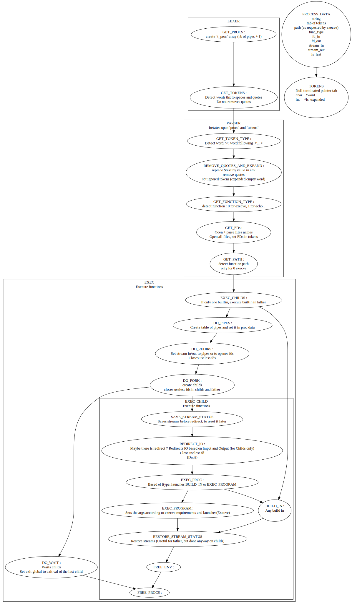

# 42-minishell

Here is our 42 minishell.

## Tester
We pass all our tester tests :

[simon-ameye/42-minishell_bash_tester_2022](https://github.com/simon-ameye/42-minishell_bash_tester_2022)

## Usage
On Linux only !

- Do ```make```

- Run ```./minishell```

- Try ```Whatever you want, it's a Shell !```


## Graph
All you need to know :

